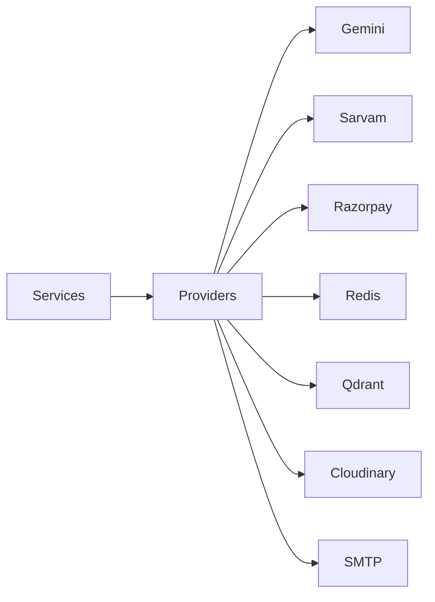
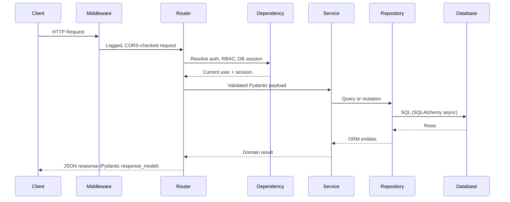

# 9. Backend Architecture

## 9.1 Overview

The BidSense backend is a FastAPI (Python) application built using a layered architecture with clear separation of concerns. Each layer has a single responsibility, making the application easier to understand, test, maintain, and extend.

The backend is designed around the following architectural patterns:

* Layered Architecture
* Clean Architecture
* Repository Pattern
* Service Layer Pattern
* Provider Pattern
* Dependency Injection (FastAPI `Depends`)
* RESTful API Design

---

# 9.2 Backend Overview

```mermaid
flowchart TB

Client

↓

Uvicorn (ASGI)

↓

FastAPI Application

↓

Middleware

↓

Routers (path operations)

↓

Dependencies (auth, RBAC, validation, DB session)

↓

Services

↓

Repositories

↓

SQLAlchemy (async)

↓

PostgreSQL
```

External services are accessed through providers.



---

# 9.3 Backend Directory Structure

```text
server/
│
├── app/
│   ├── api/
│   │   └── v1/              # routers, one module per domain
│   ├── core/                # config, security, dependencies, exceptions
│   ├── db/                  # engine, session, base, seed
│   ├── models/              # SQLAlchemy ORM models
│   ├── schemas/             # Pydantic request/response models
│   ├── repositories/        # data access, one module per aggregate
│   ├── services/            # business logic
│   ├── providers/           # Gemini, Sarvam, Razorpay, storage, email
│   ├── ai/                  # prompts, RAG, chunking, embeddings, parsers
│   ├── workers/             # Celery tasks
│   ├── templates/           # email and report templates
│   ├── utils/
│   └── main.py              # application factory and entrypoint
│
├── alembic/                 # migration environment and versions
├── tests/
├── media/                   # local file storage (development)
├── alembic.ini
└── requirements.txt
```

---

# 9.4 Layer Responsibilities

| Layer        | Responsibility                                       |
| ------------ | ---------------------------------------------------- |
| Router       | API endpoints, HTTP status codes, response models    |
| Middleware   | Cross-cutting concerns (CORS, logging, request id)   |
| Dependency   | Authentication, RBAC, DB session, pagination, upload |
| Schema       | Request validation and response serialization        |
| Service      | Business logic                                       |
| Repository   | Database operations                                  |
| Provider     | External services                                    |
| Model        | Persistent schema definition                         |

---

# 9.5 Request Lifecycle

Every request follows the same lifecycle.



---

# 9.6 Router Layer

Purpose:

Expose REST endpoints.

Responsibilities:

* URL definitions
* Dependency registration
* Status codes and response models
* Delegating to services

Example

```python
@router.post("/register", response_model=RegisterResponse, status_code=201)
async def register(
    payload: RegisterRequest,
    session: AsyncSession = Depends(get_db_session),
) -> RegisterResponse:
    return await auth_service.register(session, payload)
```

Routers must never contain business logic.

---

# 9.7 Middleware and Dependency Layer

Middleware responsibilities (applied to every request):

* Request id and structured logging
* CORS
* Security headers
* Rate limiting

Dependency responsibilities (declared per router or per endpoint):

* JWT authentication (`get_current_user`)
* RBAC authorization (`require_permission("rfp:create")`)
* Database session (`get_db_session`)
* Organization scoping (`get_current_organization`)
* File upload validation

Execution Order

```text
Request

↓

Request Logger

↓

Security Headers

↓

CORS

↓

Rate Limiter

↓

Authentication dependency

↓

Authorization dependency

↓

Pydantic validation

↓

Path operation function
```

Validation is not a middleware in FastAPI: a request body that does not match its Pydantic schema is rejected with HTTP 422 before the path operation runs.

---

# 9.8 Path Operation Functions

Purpose

Handle HTTP requests.

Responsibilities

* Declare the request and response schemas
* Resolve dependencies
* Call a service
* Return a serializable result

Path operations should remain thin.

Path operation functions should never:

* Execute SQL
* Use the SQLAlchemy session directly for business queries
* Access Redis
* Call Gemini
* Call Razorpay

---

# 9.9 Service Layer

Purpose

Business logic.

Responsibilities

* Authentication
* Organization and membership management
* Vendor Management
* RFP Workflow
* Proposal Analysis
* AI Processing
* Payment Processing
* Notifications

Services coordinate multiple repositories and providers.

Example

```text
Create Vendor

↓

Check Subscription

↓

Validate Data

↓

Save Vendor

↓

Send Notification

↓

Return Result
```

---

# 9.10 Repository Layer

Purpose

Database abstraction.

Responsibilities

* CRUD
* Transactions
* Query Optimization
* SQLAlchemy `select()` statements and eager loading

Repositories never contain business logic.

Example

```python
class UserRepository:
    async def find_by_email(self, session: AsyncSession, email: str) -> User | None: ...
    async def find_by_id(self, session: AsyncSession, user_id: UUID) -> User | None: ...
    async def create(self, session: AsyncSession, user: User) -> User: ...
    async def update(self, session: AsyncSession, user: User) -> User: ...
    async def soft_delete(self, session: AsyncSession, user_id: UUID) -> None: ...
```

---

# 9.11 Provider Layer

Purpose

Integrate third-party services.

Supported Providers

AI

* Gemini (`google-generativeai`)
* Sarvam (HTTP via `httpx`)

Payments

* Razorpay (`razorpay` Python SDK)

Storage

* Cloudinary
* Amazon S3
* Local Storage

Email

* SMTP through `fastapi-mail`

Providers isolate SDK implementations behind a narrow interface so they can be swapped or faked in tests.

---

# 9.12 AI Layer

Responsibilities

* Prompt Construction
* RAG
* Embeddings
* Vector Search
* AI Providers
* Memory
* Response Parsing

Structure

```text
app/ai/

    providers/

    rag/

    chunking/

    embeddings/

    memory/

    pipelines/

    parsers/

    prompts/
```

---

# 9.13 Database Layer

Technology

* PostgreSQL
* SQLAlchemy 2.0 (async, `asyncpg` driver)
* Alembic

Responsibilities

* Schema
* Relations
* Migrations
* Seed Data

Repositories are the only components allowed to communicate with PostgreSQL. Schema changes are applied exclusively through Alembic migrations; `Base.metadata.create_all` is not used outside throwaway test databases.

---

# 9.14 Cache Layer

Technology

Redis (`redis.asyncio`)

Stores

* OTP
* Sessions
* Cache
* Dashboard Data
* AI Context
* Rate Limits

Repositories never access Redis directly.

Redis is accessed through dedicated services.

---

# 9.15 Payment Layer

Flow

```mermaid
flowchart LR

Router

↓

Payment Service

↓

Razorpay Provider

↓

Webhook

↓

Repository

↓

Database
```

Responsibilities

* Orders
* Verification
* Subscription
* Invoice
* Refund

---

# 9.16 AI Request Flow

```mermaid
flowchart TB

User

↓

AI Router

↓

AI Service

↓

Prompt Builder

↓

Retriever

↓

Qdrant

↓

Gemini

↓

Parser

↓

Response
```

---

# 9.17 File Upload Flow

```mermaid
flowchart TB

Upload

↓

Validation

↓

Storage

↓

Metadata

↓

Celery task

↓

Parser

↓

Chunking

↓

Embeddings

↓

Qdrant

↓

Database
```

Parsing and embedding run as background Celery tasks so uploads return immediately; the document row carries a processing status that the client polls.

---

# 9.18 Dependency Rules

Allowed dependencies:

```text
Routers

↓

Services

↓

Repositories

↓

Database
```

Services may also access:

* Providers
* Redis
* AI
* Storage

Routers must never access:

* Database
* Redis
* AI Providers
* Payment Providers

Repositories must never access:

* Routers
* Services
* Providers

These rules prevent circular dependencies.

---

# 9.19 Error Handling

Every layer raises typed domain exceptions that a single FastAPI exception handler translates into the standard error envelope.

```text
Repository

↓

Service

↓

Router

↓

Global exception handler

↓

Client
```

Error Types

* Validation Error (`RequestValidationError`, HTTP 422)
* Authentication Error (HTTP 401)
* Authorization Error (HTTP 403)
* Business Error (HTTP 400 / 409)
* Database Error (HTTP 500)
* External API Error (HTTP 502)
* Payment Error
* AI Error

---

# 9.20 Logging

Every request generates logs.

Categories

* API Logs
* Database Logs
* AI Logs
* Payment Logs
* Authentication Logs
* Audit Logs

Sensitive information such as passwords, tokens, OTPs, and API keys must never be logged.

---

# 9.21 Backend Design Principles

The backend follows these architectural principles:

* Single Responsibility Principle
* Open/Closed Principle
* Dependency Inversion Principle
* Modular Design
* Clean Architecture
* RESTful APIs
* Provider Pattern
* Repository Pattern
* Service Layer Pattern

---

# 9.22 Layer Responsibilities Summary

| Layer      | Responsibility         |
| ---------- | ---------------------- |
| Router     | Endpoint definition    |
| Middleware | Cross-cutting concerns |
| Dependency | Auth, RBAC, session    |
| Schema     | Validation             |
| Service    | Business logic         |
| Repository | Database access        |
| Provider   | External services      |
| Database   | Data persistence       |
| Redis      | Cache                  |
| Qdrant     | Vector search          |
| AI         | Intelligent processing |

---

# 9.23 Summary

The BidSense backend architecture enforces strict separation between HTTP handling, business logic, persistence, and third-party integrations. Routers remain lightweight, services orchestrate workflows, repositories encapsulate SQLAlchemy queries, and providers isolate external systems such as Gemini, Sarvam AI, Razorpay, Redis, Qdrant, and Cloudinary. This structure improves maintainability, testability, and scalability while providing a solid foundation for enterprise procurement workflows and AI-powered features.
