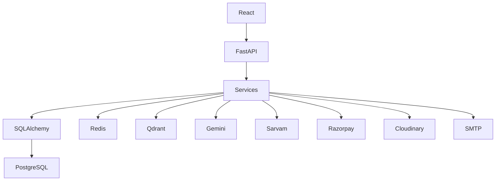

# 5. Technology Stack

## 5.1 Overview

BidSense is built using a React frontend and a Python (FastAPI) backend, designed for scalability, maintainability, AI integration, and cloud deployment.

The selected technologies emphasize:

* Production readiness
* Strong community support
* Developer productivity
* Modular architecture
* AI-first development
* Horizontal scalability

---

# 5.2 Technology Stack Overview

| Layer                 | Technology                             |
| --------------------- | -------------------------------------- |
| Frontend              | React 19                               |
| Build Tool            | Vite                                   |
| Routing               | React Router 7                         |
| Styling               | Tailwind CSS v4                        |
| State Management      | TanStack Query                         |
| Forms                 | React Hook Form                        |
| Validation (Frontend) | Zod                                    |
| HTTP Client           | Axios                                  |
| Backend               | FastAPI                                |
| Runtime               | Python 3.11+ / Uvicorn (ASGI)          |
| Language              | Python (async/await)                   |
| Validation (Backend)  | Pydantic v2                            |
| ORM                   | SQLAlchemy 2.0 (async) + Alembic       |
| Database              | PostgreSQL (asyncpg driver)            |
| Cache                 | Redis                                  |
| Background Jobs       | Celery (Redis broker)                  |
| Vector Database       | Qdrant                                 |
| AI Providers          | Gemini, Sarvam AI                      |
| Payment Gateway       | Razorpay (Python SDK)                  |
| Email                 | fastapi-mail (SMTP)                    |
| File Upload           | Starlette `UploadFile` (python-multipart) |
| File Storage          | Local Storage / Cloudinary / Amazon S3 |
| Documentation         | OpenAPI 3 (generated by FastAPI)       |
| Authentication        | JWT + Refresh Tokens                   |
| Password Hashing      | bcrypt (passlib)                       |
| Testing               | pytest, pytest-asyncio, httpx          |
| Containerization      | Docker                                 |
| Reverse Proxy         | Nginx                                  |
| CI/CD                 | GitHub Actions                         |

---

# 5.3 Frontend Technologies

## React 19

Purpose:

* Build the user interface.

Why React?

* Component-based architecture.
* Large ecosystem.
* Strong community support.
* Excellent performance.
* Easy integration with REST APIs.
* Suitable for enterprise applications.

---

## Vite

Purpose:

Development server and build tool.

Why Vite?

* Extremely fast startup.
* Instant Hot Module Replacement (HMR).
* Optimized production builds.
* Native ES Module support.

---

## React Router 7

Purpose:

Client-side routing.

Responsibilities:

* Protected routes.
* Nested layouts.
* Dynamic routing.
* Route parameters.

---

## Tailwind CSS v4

Purpose:

User interface styling.

Why Tailwind?

* Utility-first design.
* Consistent design system.
* Small production bundles.
* Fast development.

---

## TanStack Query

Purpose:

Server-state management.

Responsibilities:

* API caching.
* Background refetching.
* Optimistic updates.
* Request deduplication.
* Automatic retries.

---

## React Hook Form

Purpose:

Form management.

Responsibilities:

* Input registration.
* Validation.
* Error handling.
* Performance optimization.

---

## Zod

Purpose:

Frontend validation.

Responsibilities:

* Type-safe schemas.
* Shared validation rules.
* Form validation.

---

# 5.4 Backend Technologies

## Python 3.11+ / Uvicorn

Purpose:

Runtime environment.

Why Python?

* First-class AI and document-processing ecosystem (the core of BidSense).
* Mature async support through ASGI and `asyncio`.
* Official SDKs for Gemini, Qdrant, and Razorpay.
* Uvicorn provides a fast, production-ready ASGI server.

---

## FastAPI

Purpose:

REST API framework.

Responsibilities:

* Routing (`APIRouter` per module).
* Middleware and dependency injection.
* Request parsing and validation.
* Response serialization.
* Centralized exception handling.

Why FastAPI?

* Request/response validation comes from Pydantic models, not hand-written checks.
* OpenAPI 3 schema and Swagger UI are generated automatically.
* Dependency injection makes auth, RBAC, and DB sessions composable.
* Async-native, so AI and vector-search calls do not block the event loop.

---

## Pydantic v2

Purpose:

Backend validation and settings.

Responsibilities:

* Request and response schemas.
* Typed configuration via `BaseSettings`.
* Serialization boundaries between API and ORM models.

---

# 5.5 Database

## PostgreSQL

Purpose:

Primary relational database.

Stores:

* Users
* Organizations
* Vendors
* RFPs
* Proposals
* Payments
* Notifications
* Audit Logs

Why PostgreSQL?

* ACID compliance.
* High reliability.
* Excellent indexing.
* JSON support.
* Full-text search.
* Enterprise-grade performance.

---

## SQLAlchemy 2.0 + Alembic

Purpose:

Database ORM and schema migrations.

Responsibilities:

* Declarative schema definition (`DeclarativeBase` models).
* Versioned migrations through Alembic.
* Typed queries via the 2.0 `select()` API.
* Relationship and eager-loading management.

Why SQLAlchemy?

* Full async support with the `asyncpg` driver.
* Mature migration tooling (Alembic) with autogenerate.
* Escape hatch to raw SQL wherever the ORM is the wrong tool.
* Well understood transaction and session semantics.

---

# 5.6 Cache Layer

## Redis

Purpose:

In-memory data store.

Responsibilities:

* OTP storage.
* Session cache.
* Rate limiting.
* Dashboard cache.
* AI context cache.

Why Redis?

* Extremely fast.
* Supports expiration.
* Ideal for temporary data.
* Widely adopted.

---

# 5.7 AI Stack

## Gemini

Purpose:

Primary Large Language Model.

Responsibilities:

* RFP generation.
* Proposal analysis.
* Compliance checking.
* Summarization.
* AI chat.
* Reasoning.

---

## Sarvam AI

Purpose:

Indian language support.

Responsibilities:

* Translation.
* Regional language understanding.
* Speech capabilities (future).
* Localization.

---

# 5.8 Retrieval-Augmented Generation (RAG)

## Qdrant

Purpose:

Vector database.

Responsibilities:

* Store embeddings.
* Semantic search.
* Context retrieval.
* Similarity search.

Why Qdrant?

* Open source.
* High performance.
* Docker support.
* REST API.
* Optimized for AI applications.

---

# 5.9 File Processing

## Uploads

Handled natively by Starlette's `UploadFile` (backed by `python-multipart`); size and MIME validation live in a shared upload dependency.

Supported Files:

* PDF
* DOCX
* XLSX
* CSV
* Images

---

## Document Parsing

Libraries:

* pypdf (PDF text extraction)
* python-docx (DOCX)
* openpyxl (XLSX)
* pandas (CSV)
* reportlab (generated PDFs: invoices, reports)

Responsibilities:

* Extract text.
* Generate metadata.
* Feed RAG pipeline.

---

# 5.10 Storage

Development:

* Local Storage

Production:

* Cloudinary
* Amazon S3

Responsibilities:

* Document storage.
* Proposal files.
* User avatars.
* Generated reports.

---

# 5.11 Payment Gateway

## Razorpay

Purpose:

Subscription billing.

Responsibilities:

* Create orders.
* Verify payments.
* Handle webhooks.
* Generate invoices.
* Manage subscriptions.

Why Razorpay?

* Official Python SDK.
* UPI support.
* Subscription APIs.
* Indian payment ecosystem.

---

# 5.12 Authentication

## JWT

Purpose:

Authentication.

Responsibilities:

* Access Token
* Refresh Token

---

## bcrypt

Purpose:

Password hashing.

Responsibilities:

* Hash passwords.
* Verify passwords.

---

# 5.13 Email

## fastapi-mail

Purpose:

Email delivery.

Templates:

* OTP
* Password Reset
* Vendor Invitation
* Invoice
* Payment Confirmation

---

# 5.14 Documentation

## OpenAPI 3 (built into FastAPI)

Purpose:

API documentation, served at `/api/docs` with the raw schema at `/api/openapi.json`.

Benefits:

* Interactive testing.
* API reference.
* Client integration.
* Developer onboarding.

---

# 5.15 Testing

## pytest / pytest-asyncio

Purpose:

Unit and integration testing of async services.

---

## httpx.AsyncClient (with ASGI transport)

Purpose:

API testing against the app in-process, without binding a port.

Responsibilities:

* Endpoint validation.
* Authentication tests.
* Integration tests.

---

# 5.16 Containerization

## Docker

Purpose:

Containerize the application.

Containers:

* Backend
* PostgreSQL
* Redis
* Qdrant

Benefits:

* Consistent environments.
* Easy deployment.
* Simplified onboarding.

---

# 5.17 Reverse Proxy

## Nginx

Responsibilities:

* HTTPS termination.
* Reverse proxy.
* Load balancing.
* Static asset delivery.
* Compression.

---

# 5.18 CI/CD

## GitHub Actions

Responsibilities:

* Install dependencies.
* Run linting.
* Execute tests.
* Build Docker image.
* Deploy application.

---

# 5.19 Development Tools

| Tool             | Purpose                              |
| ---------------- | ------------------------------------ |
| Ruff             | Linting (backend)                    |
| Black            | Code formatting (backend)            |
| mypy             | Static type checking (backend)       |
| ESLint / Prettier| Code quality and formatting (client) |
| pre-commit       | Git hooks and pre-commit validation  |
| pydantic-settings| Environment configuration            |
| `uvicorn --reload` | Development server                 |
| Docker Desktop   | Local containers                     |

---

# 5.20 Architecture Technology Flow

---

# 5.21 Technology Selection Rationale

| Requirement    | Selected Technology | Reason                                 |
| -------------- | ------------------- | -------------------------------------- |
| UI Development | React 19            | Modern component architecture          |
| Backend API    | FastAPI             | Async, typed, self-documenting         |
| Database       | PostgreSQL          | Reliable relational database           |
| ORM            | SQLAlchemy 2.0      | Async ORM with mature migrations       |
| Cache          | Redis               | Fast in-memory operations              |
| Vector Search  | Qdrant              | Open-source vector database            |
| AI             | Gemini              | Strong reasoning and document analysis |
| Regional AI    | Sarvam AI           | Indian language support                |
| Payments       | Razorpay            | Best fit for Indian SaaS               |
| Storage        | Cloudinary / S3     | Scalable file storage                  |
| Authentication | JWT                 | Stateless authentication               |
| Containers     | Docker              | Consistent deployments                 |

---

# 5.22 Summary

The BidSense technology stack is designed around modern, production-ready technologies that complement one another. PostgreSQL and SQLAlchemy provide a reliable transactional data layer, Redis accelerates frequently accessed data, Qdrant powers semantic retrieval for the AI subsystem, Gemini and Sarvam deliver intelligent document analysis and multilingual capabilities, and Razorpay enables subscription billing for the SaaS platform. Together, these technologies provide a scalable foundation capable of supporting future enhancements while maintaining a clean and maintainable architecture.
